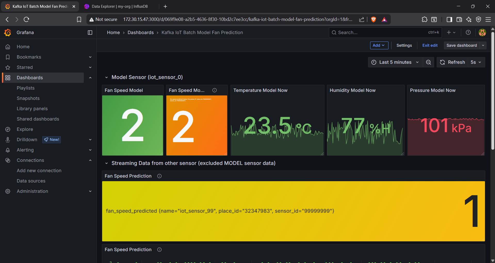

# Online Prediction

1. เชื่อมต่อ InfluxDB
2. Load Model 
3. เชื่อมต่อ Kafka
4. นำข้อมูลจาก Kafka มา Predict
5. นำค่า Predict อัพโหลดไป InfluxDB
<!-- Online Prection ทำงานอย่างไร  -->

## ปิดการใช้งานของ Batch ML ดังนี้

1. Kafka-to-Jsonl
2. Train-from-data
3. Predict-then-influxdb

## เริ่มใช้งาน Online ML ดังนี้

1. docker compose down batch ml services
2. แก้ไฟล์ .env
3. docker compose up online ml service

## ผลที่ได้จากการใช้ ML มีดังนี้

<!-- แนบรูป Grafana  พร้อมอธิบาย -->
